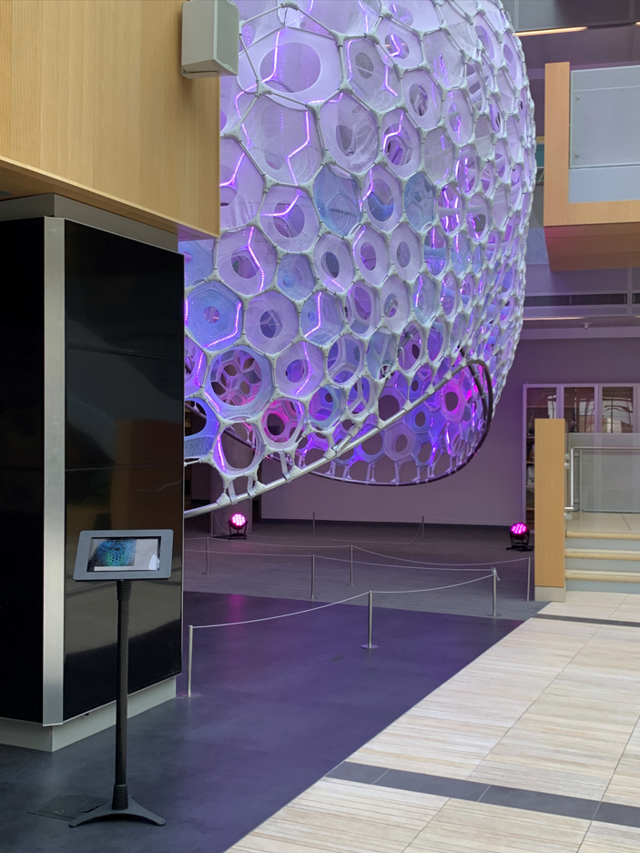
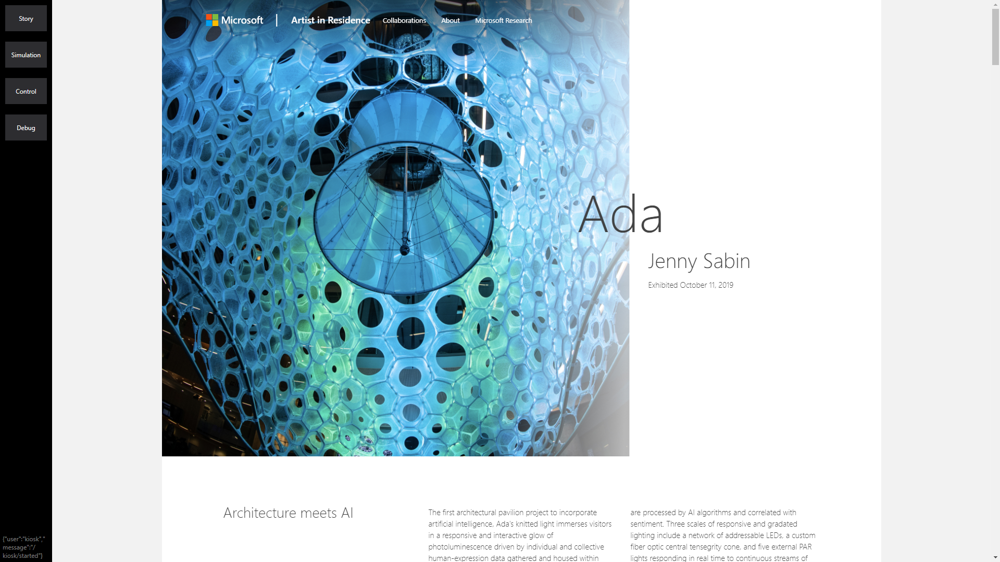
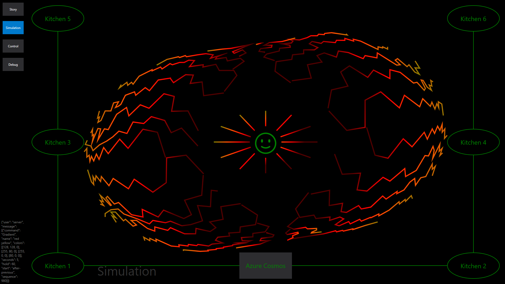
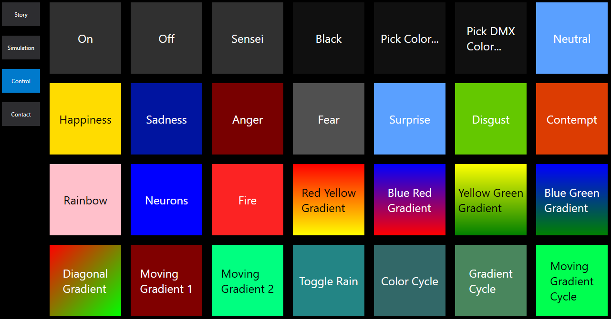

## AdaKiosk

This is a Windows WPF app that provides a nice Kiosk experience to
accompany Ada.

Install: [setup.exe](https://adaserverstorage.blob.core.windows.net/adakiosk/ClickOnce/setup.exe)

## Home page

The app comes up by default in full screen mode.  Press F11 to get out of full screen mode.

This page is the default and provides access to the beautiful blog on Ada detailing the design
concepts and construction effort.  This app connects to Ada via the very cool new [Azure Web Pub Sub service](https://azure.microsoft.com/en-us/services/web-pubsub/),
and shows realtime information on what Ada is thinking while also allowing the user to control Ada.
It also auto-updates itself via the [AdaKioskService](../AdaKioskService/readme.md).

## Simulation

This page runs a visual simulation of what Ada is doing. You
can also click on the kitchens to generate random color events.
This page will also tell you when Ada is sleeping and whether the
Ada server is offline.

## Control

This page provides some simple controls over Ada so you override the Ada
default schedule with the On/Off buttons, you can set specific colors or
pick the specified emotion and you can run specific animations as defined
in the Server/config.json.

## Debug

This is an advanced page for testing individual LED's on Ada.
This page is only made visible when a /debug/true message is sent
to the Kiosk.

## Unit Testing

See [AdaKioskUnitTest.exe](../AdaKioskUnitTest/readme.md).