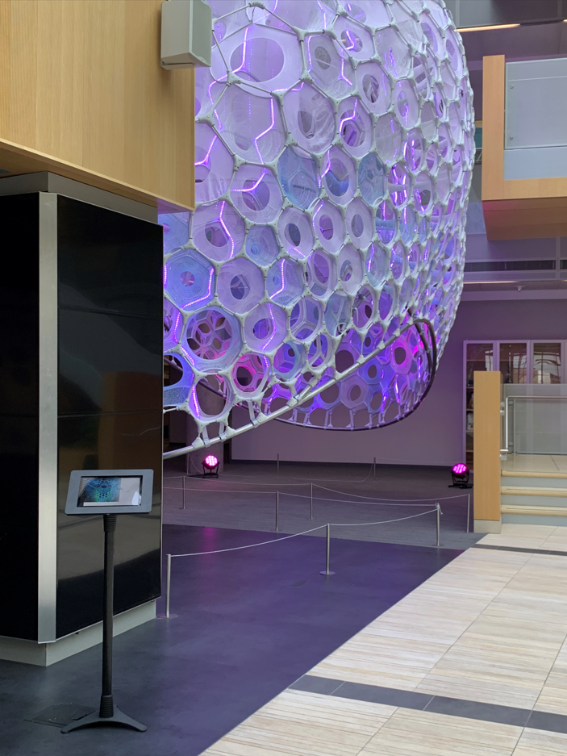
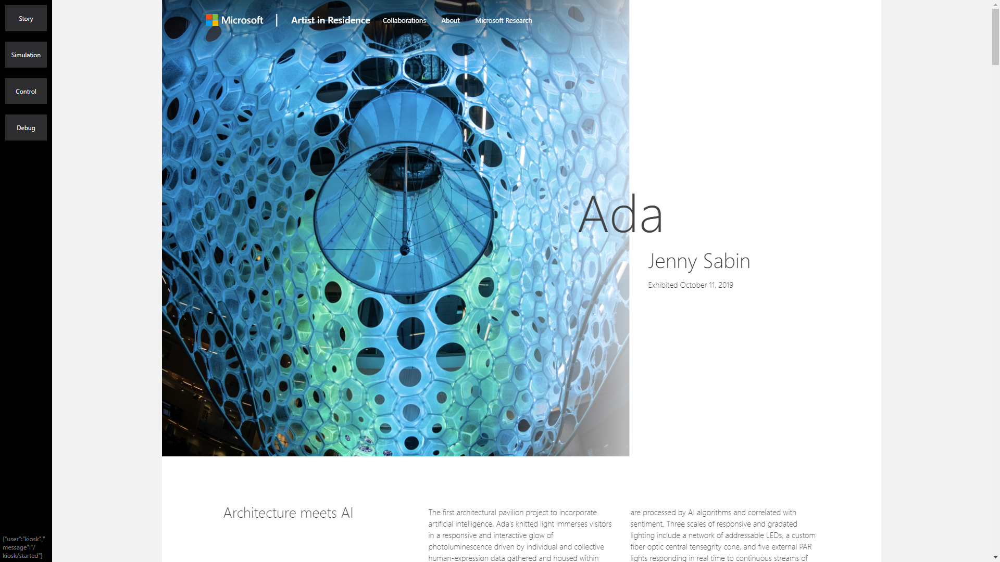
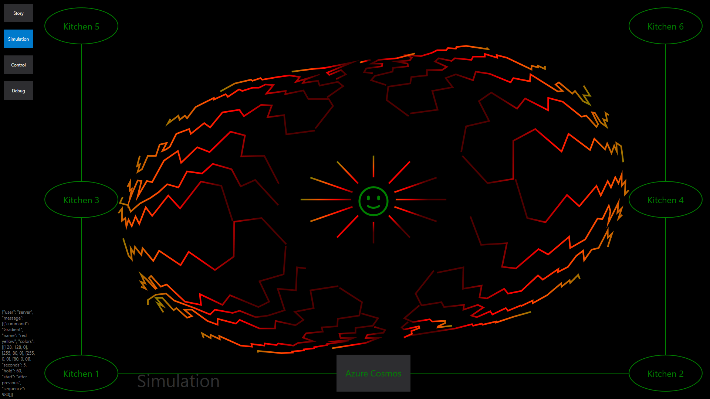
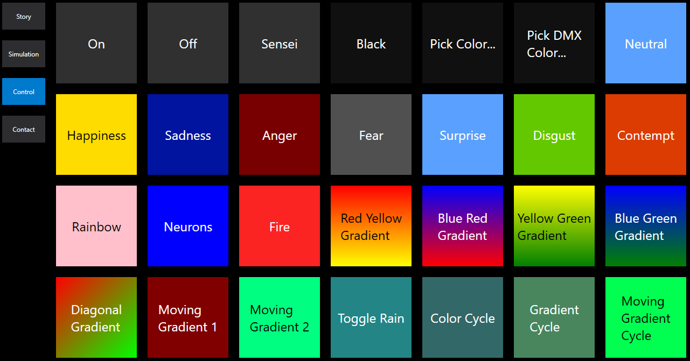

## AdaKiosk

The AdaKiosk app is running on a Windows 10 tablet in the building 99 lobby in a locked stand.
This is running Windows 10, because Windows 11 removed kiosk mode in the OS.

The kiosk is configured to boot when the power is plugged in, and auto-login the user named "ada"
and that login is configured to auto-launch the AdaKiosk app when it does that.

Note: sometimes some kids like to try and break it, and if they kill the Ada app then it leaves the PC in a state that
allows sleep mode to click in and the power unplug/replug does not bring it out of sleep mode, so for that you need to
open the case and press the power button.  Then when it comes out of sleep use the onscreen power button to reboot it.
This brings back the Kiosk app this disables sleep mode. 
There's probably a windows setting some place to fix that but might take some digging.  

## App

The app is Windows WPF app that provides a nice Kiosk experience to
accompany Ada.

Install: [setup.exe](https://adaserverstorage.blob.core.windows.net/downloads/AdaKiosk/setup.exe)

## Home page

The app comes up by default in full screen mode.  Press F11 to get out of full screen mode.

This page is the default and provides access to the beautiful blog on Ada detailing the design
concepts and construction effort.  This app connects to Ada via the very cool new [Azure Web Pub Sub service](../AdaWebPubSub/readme.md),
and shows realtime information on what Ada is thinking while also allowing the user to control Ada.
It also auto-updates itself via the [AdaKioskService](../AdaKioskService/readme.md).

## Simulation

This page runs a visual simulation of what Ada is doing. You
can also click on the kitchens to generate random color events.
This page will also tell you when Ada is sleeping and whether the
Ada server is offline.

## Control

This page provides some simple controls over Ada so you override the Ada
default schedule with the On/Off buttons, you can set specific colors or
pick the specified emotion and you can run specific animations as defined
in the Server/config.json.

## Debug

This is an advanced page for testing individual LED's on Ada.
This page is only made visible when a /debug/true message is sent
to the Kiosk.

## Unit Testing

See [AdaKioskUnitTest.exe](../AdaKioskUnitTest/readme.md).