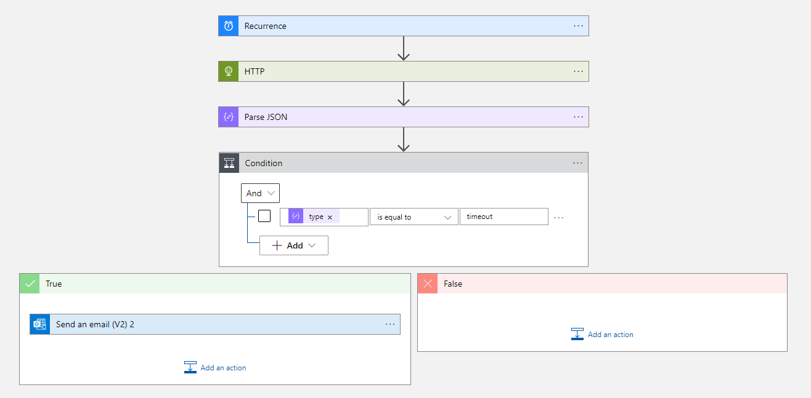

## AdaServerRelay

This project provides an HTTP gateway to the `Azure Web Pub Sub` service used for communication between the Ada
Server and the AdaKiosk.

You can use the HTTP gateway to send these messages:

- /ping
- /bridge
- /kiosk/version/?

This relay can then be used in an Azure Logic App to ping the Ada Server every 15 minutes to make sure
it is still responding correctly and if a timeout occurs, send an email to someone to fix it.

