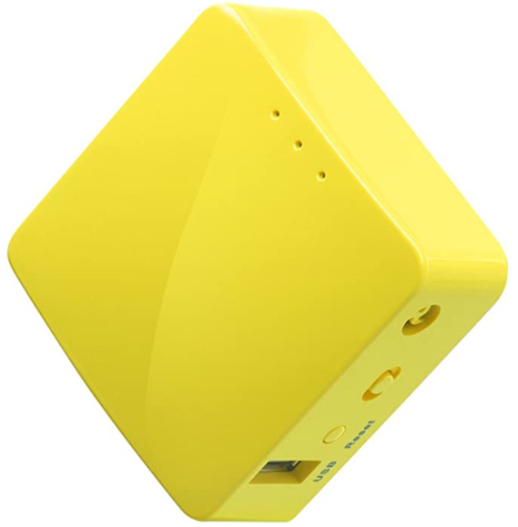

## Kasa Bridge

There is a Raspberry Pi Zero running as a "Wifi Access Point" inside the Server panel in a red and white plastic case:

This wifi access point is connected to the Security Gateway (router)
and the Kasa HS105 power switches are connected to this Raspberry Pi
Wifi network on (192.168.4.*).

This raspberry pi then acts as a bridge for controlling the
Kasa HS105 power switches so the Kasa HS105 power switches are NOT
on a corporate wifi network.

The `bridge_client.py` script runs on the Server to provide access
to the relay, and the `bridge.py` script runs on the Raspberry Pi Zero
relaying commands to the Kasa HS105 switches.

Supported commands are:
- **list** to list the discovered HS105 devices
- **status** get the on/off status of the devices
- **on** turn on all switches
- **off** turn off all switches

The `bridge.py` uses the `tplink_smartplug.py` to discover the devices.
All devices that respond to valid UDP `get_sysinfo` with a model string containing `HS105` are the
correct devices to work with, this way no fixed ip addresses
need to be configured anywhere in this bridge system.

This Raspberry Pi Zero runs the `bridge.py` script on reboot so it should
just keep working.