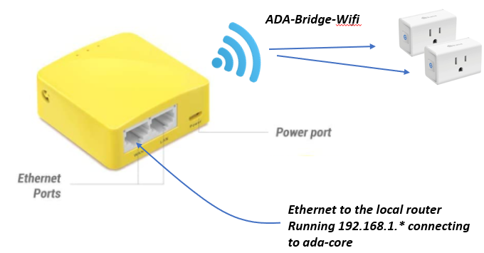

## Kasa Bridge

We use a [GL.iNet GL-MT300N-V2 Mini Wifi Access Point](https://www.amazon.com/gp/product/B073TSK26W/ref=ppx_yo_dt_b_asin_title_o00_s00?ie=UTF8&psc=1) inside the Server panel to
connect to the Wifi only
[https://www.amazon.com/gp/product/B091FXLMS8/ref=ppx_yo_dt_b_search_asin_title?ie=UTF8&psc=1](Kasa EP10 Smart Plugs) which power the Ada Led strips.

This wifi access point is connected to the Security Gateway (router)
and the Kasa EP10 power switches are connected to this Raspberry Pi
Wifi network on (192.168.4.*).

This bridge controls the
Kasa EP10 power switches so the Kasa EP10 power switches are NOT on a corporate wifi network.

The `bridge_client.py` script runs in the `Server` to provide access
to the relay, and the `bridge.py` script runs in a
separate window on the ada-core machine to relay commands to the Kasa EP10 switches.

Supported commands are:
- **list** to list the discovered EP10 devices
- **status** get the on/off status of the devices
- **on** turn on all switches
- **off** turn off all switches

The `bridge.py` uses the `tplink_smartplug.py` to discover the devices.
All devices that respond to valid UDP `get_sysinfo` with a model string containing `HS105`, `HS103`, or `EP10` are the
correct devices to work with, this way no fixed ip addresses
need to be configured anywhere in this bridge system.
