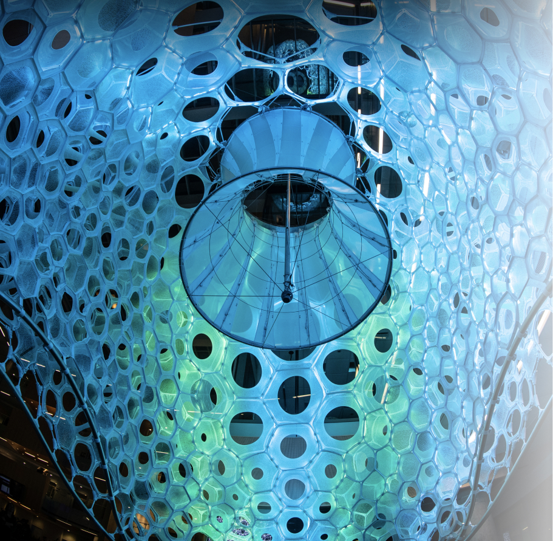
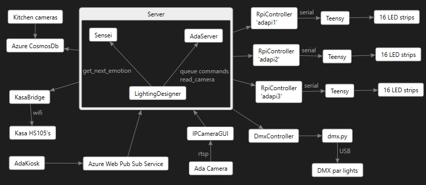

# Introduction

This repo contains the software needed to run Ada.



## Design



The following is what is current:

- [TeensyFirmware](TeensyFirmware/readme.md) the C++ firmware running on the Teensy's.
- [TeensyUnitTest](TeensyUnitTest/readme.md) a windows C++ app that unit tests all the Teensy code.
This is especially important because Teensy boards do not support debugging.
- [DmxController](DmxController/README.md) the python app that controls the big DMX par lights on the floor.  This gets commands from the Server.
- [RpiController](RpiController/readme.md) the C++ app that runs on the Raspberry Pis bridging the Server on the PC to the Teensys.  Also provides some handy test menu options for manually setting colors and animations.
- [Server](Server/readme.md) the Python app that runs on the Server PC on the 3rd floor, pushes to the RpiController and DMX controller and retrieves Sensei data from cosmosdb, and the Ada camera.
- [Azure](Azure/readme.md) a scrip for setting up your Azure Web Pub Sub service.
- [EmotionDetector](EmotionDetector/readme.md) a C# project that wraps the emotion detector model, providing a COM object that is used by IPCameraGUI.
- [IPCameraGUI](IPCameraGUI/readme.md) reads the RTSP stream from the Ada Camera and performs movement detection, face detection and EmotionDetection, sending detections to the Server.
- [AdaKiosk](AdaKiosk/readme.md) a C# WPF app that simulates and controls Ada designed for a kiosk tablet device.
- [AdaKioskUnitTest](AdaKioskUnitTest/readme.md) a C# WPF app that simply prints all Web Pub Sub messages going on between
the kiosk and the Ada Server.
- [AdaKioskService](AdaKioskService/readme.md) a C# app runs as a system service
on the AdaKiosk to perform auto-updating of the AdaKiosk app.
the kiosk and the Ada Server.
- [PiBridge](PiBridge/readme.md) the Raspberry Pi Zero Wifi bridge to the Kasa Power switches.
- **HistoricalData** Some *.csv files that capture some historical data
from cosmos which can be used in "replay mode" by the Server.

The following are there for `Archive` purposes only:
- Ada-Serial-Test
- DMX-Drivers
- JennyPrototype
- handtracking


# Setup Raspberry Pi

The raspberry pis also have a clone of this Ada git repo.
Each pi is named `adapi1`, `adapi2`, `adapi3`.
The Server Admin account has SSH key setup for logging into each pi which you can do like this:

```
ssh pi@adapi1
```

Then check if `RpiController` is already running using `ps -ax` if it is you can kill it so you can update it as follows:

```
cd /home/pi/git/Ada
git pull
```

If you get new TeensyFirmware then run this:

```
cd /home/pi/git/Ada/TeensyFirmware
./flash.sh
```

Then to build the RpiController:
```
cd RpiController
mkdir build && cd build && cmake ..
make
```

Then you can launch it by running the `run.sh` script in the RpiController folder.

You will see it connect to the Teensy over Serial, automatically finding the serial port:

```
Looking for server: ada-core...
Found Teensy at: /dev/ttyACM0, Teensyduino_USB_Serial_6116590
Using local ip "192.168.1.8"
Using server ip "192.168.1.11"
Auto-starting Sensei
```

It also connects to the Server named 'ada-core' and auto-starts the Sensei command which
receives lighting commands from the Server.

When you reboot the pi it should do all this automatically, including git pull and build
so it will always be up to date and it will auto-start `Sensei` mode.


## Contributing

This project welcomes contributions and suggestions.  Most contributions require you to agree to a
Contributor License Agreement (CLA) declaring that you have the right to, and actually do, grant us
the rights to use your contribution. For details, visit https://cla.opensource.microsoft.com.

When you submit a pull request, a CLA bot will automatically determine whether you need to provide
a CLA and decorate the PR appropriately (e.g., status check, comment). Simply follow the instructions
provided by the bot. You will only need to do this once across all repos using our CLA.

This project has adopted the [Microsoft Open Source Code of Conduct](https://opensource.microsoft.com/codeofconduct/).
For more information see the [Code of Conduct FAQ](https://opensource.microsoft.com/codeofconduct/faq/) or
contact [opencode@microsoft.com](mailto:opencode@microsoft.com) with any additional questions or comments.

## Trademarks

This project may contain trademarks or logos for projects, products, or services. Authorized use of Microsoft
trademarks or logos is subject to and must follow
[Microsoft's Trademark & Brand Guidelines](https://www.microsoft.com/en-us/legal/intellectualproperty/trademarks/usage/general).
Use of Microsoft trademarks or logos in modified versions of this project must not cause confusion or imply Microsoft sponsorship.
Any use of third-party trademarks or logos are subject to those third-party's policies.
