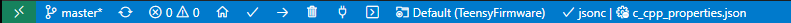

## TeensyFirmware

You can build this project using VS Code after installing the [
PlatformIO extension](https://marketplace.visualstudio.com/items?itemName=platformio.platformio-ide).

You'll have to wait for PlatformIO to finish installing before you attempt
to build the code.  Wait until the following spinning wheel is finished:


Then run `code TeensyFirmware.code-workspace` to load this workspace and use the PlatformIO build button
in the VS Code taskbar, which is the check icon you see below:




# Setup Teensy Firmware

Typically you build this on your own developer machine, and not on `ada-core`. PlatformIO will build
the `firmware.hex` file in `.pio\build\teensy40\` so to get this over to the raspberry pi devices,
there's a `PublishFirmware.py` in the `Azure` folder.  Run `python PublishFirmware.py` to send
the built firmware.hex file to an Azure blob store using your `ADA_STORAGE_CONNECTION_STRING`
environment variable.

The `ada_server.py` script will check this Azure firmware once a day and will send it to the
raspberry pi devices for automatic over the air firmware upgrades.

You should see it complete the programming job quickly.

# Raspberry Pi Setup

On each new Raspberry Pi you will need to run these setup steps:

```
sudo usermod -a -G gpio pi
sudo apt-get install libusb-dev
cd ~
mkdir git
cd git
git clone https://github.com/PaulStoffregen/teensy_loader_cli
make
```

The resulting `teensy_loader_cli` tool is used by the `TeensyFirmware\flash.sh` script to update the firmware on the Teensy.

The Teensy should show up in a path like this `/dev/serial/by-id/usb-Teensyduino_USB_Serial_6116170-if00`.  If it is not there then there may be a problem with the Teensy or the serial connection.
