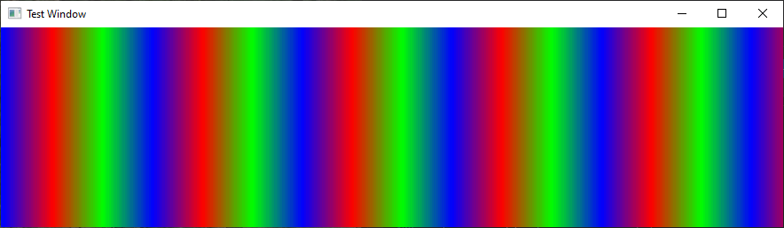
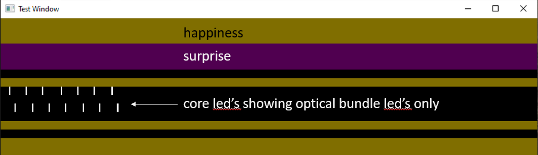

## TeensyUnitTest

This is a Windows C++ application that tests all the TeensyFirmware code and provides a handy
UI that shows the animations that would be sent to the LED strips.  This is important because
the Teensy board itself is not debuggable so we need to stress test every line of code to
ensure it works properly.

## Unit Test mode

To just run the unit tests simply launch the program with no command line arguments.
You will see a window popup that shows the animations being tested like this rainbow test:



## Integration Test mode

You can also use this app to test the end-to-end stack from `ada_server` through `RpiController` as follows:

1. Run the `ada_server.py` on `localhost`.
2. Run `TeensyUnitTest` with the command line argument `--client`.
This causes the TeensyUnitTest to listen on a TCP socket for commands, testing the exact same command processing
loop that runs in the TeensyFirmware.
3. Run `RpiController` on the same machine with `--tcp localhost`.
This connects the RpiController to the TeensyUnitTest so that it drives the animations.
4. You can also unit test RpiController on a raspberry pi talking to TeensyUnitTest on a PC by providing the ip address of the machine running TeensyUnitTest `--tcp 192.168.1.18`, and providing this same address on the TeensyUnitTest command line with `TeensyUnitTest --client 192.168.1.18` so now the raspberry pi is driving the animations.

You can then enter command line commands in RpiController and you
will immediately see the result in the TeensyUnitTest window.
If you type "s" in the RpiController it will get commands from the
`ada_server` also running on the same machine.

Now you can run this for a week and make sure everything is 100% stable,
and especially make sure there are no memory leaks in the TeensyUnitTest
because that would be a big problem in the TeensyFirmware.

You can also reduce the `playback_delay` in the Server `config.json`
to make it run much faster which makes a better stress test.

For example, when the server advances to this row of playback data:
```
Got new emotions: ['Happiness', 'Happiness', 'Surprise', 'Surprise', 'Happiness', 'Surprise']
```
You will see this in the TeensyUnitTest window:



**Note:** The strips are laid out horizontally and
16 of them are stacked vertically.  This mapping from camera zones to led strips is described in the Server `zone_map_1.json` (since RpiController is pretending to be `adapi1`).

Now also fire up `IPCameraGUI/demo_test.py` and have some real fun with
the animations that respond to movement, 3 faces, and facial expressions.  This script
defaults to a 10 second timeout between different events, so change that to something small to create a really good test.